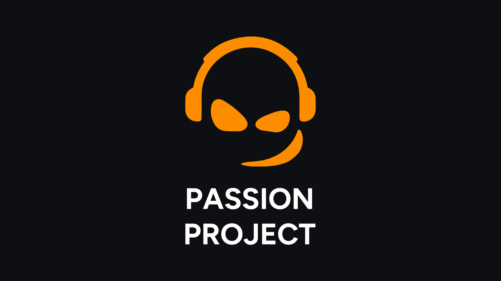

This repository was made for a Home Project as part of the INFO-AP course at Gábor Dénes University.

> The code of this project was hastily written is a span of 2 days and if it ever was to see real production, it would need a major rewrite.

#### Technologies used

| **Framework**   | **React**         |
| :-------------- | :---------------- |
| **Routing**     | **React-Router**  |
| **Stylesheets** | **Sass**          |
| **Animations**  | **Framer Motion** |
| **Map**         | **Leaflet**       |
| **Assets**      | **Photoshop**     |

#### Support

> Although dynamic, it does not inherently support phone resolutions. (subject to change)

#### Clone

You can clone this project using:

```sh
git clone https://github.com/Py-xel/INFOAP.git
```
